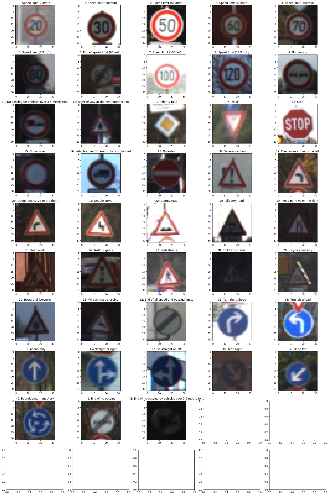
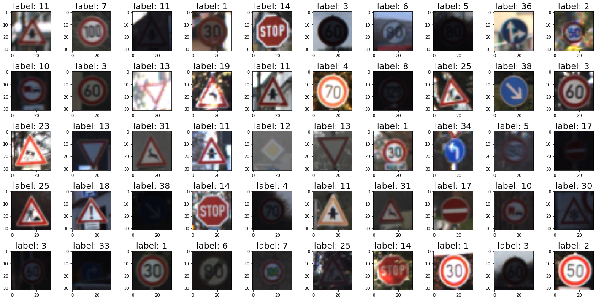
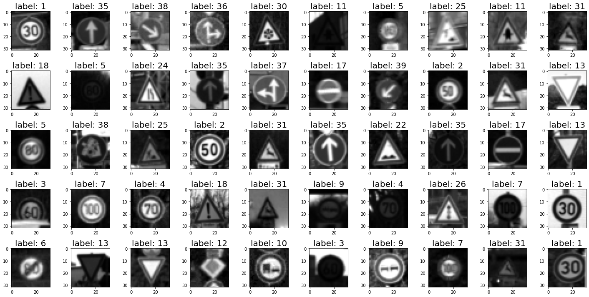
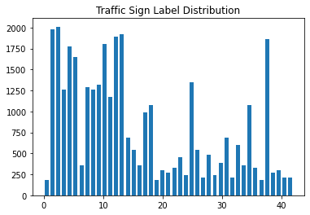
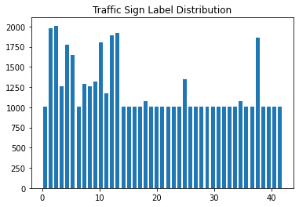
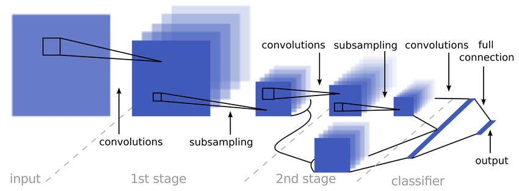
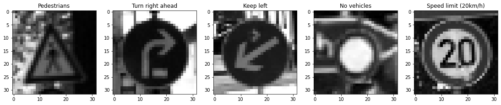
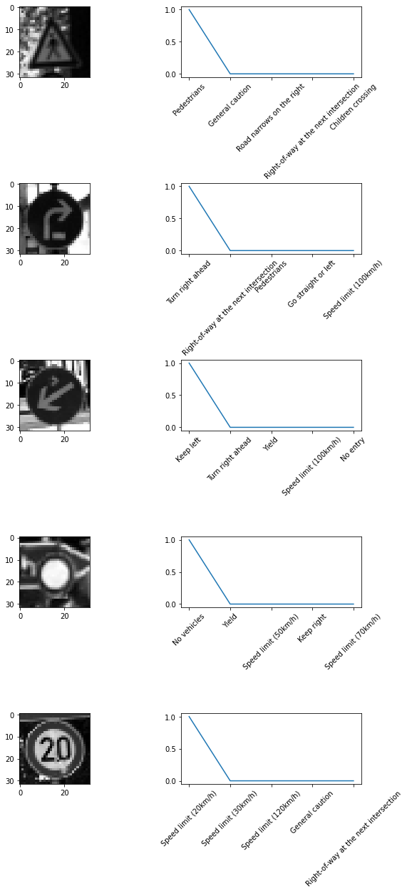
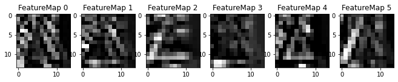

# **Traffic Sign Recognition** 

## Writeup

---

**Build a Traffic Sign Recognition Project**

The goals / steps of this project are the following:
* Load the data set (see below for links to the project data set)
* Explore, summarize and visualize the data set
* Design, train and test a model architecture
* Use the model to make predictions on new images
* Analyze the softmax probabilities of the new images
* Summarize the results with a written report

[//]: # (Image References)

[image1]: ./test_images/00000_00009.ppm "Traffic Sign 1"
[image2]: ./test_images/00000_00027.ppm "Traffic Sign 2"
[image3]: ./test_images/00004_00000.ppm "Traffic Sign 3"
[image4]: ./test_images/00005_00029.ppm "Traffic Sign 4"
[image5]: ./test_images/00006_00016.ppm "Traffic Sign 5"

## Rubric Points
### Here I will consider the [rubric points](https://review.udacity.com/#!/rubrics/481/view) individually and describe how I addressed each point in my implementation.

---
### Writeup / README

#### 1. Jupyter Notebook and source code folder

In notebook, there is a copy of the code from source code folder to for the purpose of project submission.

- Notebook: [Project Notebook](https://github.com/kunlin596/CarND-Traffic-Sign-Classifier-Project/blob/master/Traffic_Sign_Classifier.ipynb)
- Notebook HTML output: [Project Notebook HTML](https://github.com/kunlin596/CarND-Traffic-Sign-Classifier-Project/blob/master/Traffic_Sign_Classifier.html)
- Source code: [Source code](https://github.com/kunlin596/CarND-Traffic-Sign-Classifier-Project/tree/master/python)

### Data Set Summary & Exploration

#### 1. Provide a basic summary of the data set. In the code, the analysis should be done using python, numpy and/or pandas methods rather than hardcoding results manually.

I used the pandas library to calculate summary statistics of the traffic
signs data set:

* The size of training set is `34799`
* The size of the validation set is `4410`
* The size of test set is `12630`
* The shape of a traffic sign image is `(32, 32, 3)`
* The number of unique classes/labels in the data set is `43`

#### 2. Include an exploratory visualization of the dataset.

1. Sample image of all labels

### Design and Test a Model Architecture

#### 1. Data processing

As a first step, I decided to convert the images to grayscale because under different lighting conditions and the appearance of the sign could be very different. The traffic sign recognition is focusing on recognizing the shape on the sign instead of it's color. By converting it from color image to gray scale image, we can obtain a more robust (to color variation) learning result.

Also the grayscale image is later normalized to be within range `[-1, 1]`. In this case, to normalize it or not shouldn't make a big differece, since we have only one kind of data with is the pixel intensity and it's within range `[0, 255]`. However, if we are going to input different kind of features, the feature has a large value will dominate the traning process (afterall, deep learning is based on linear combinations), so we need to normalize them into the same scale such that they could be treated equally. Because of this, normalization is done on the data set.

| Before normalization | After normalization |
|:-------------------:|:------------------:|
|  |  |

Moreover, after we plotted out the distribution of the labels in the whole training data set, we could find out that the data set is unbalanced, which means the model will fit itself better to the label with more images, for the minority label, the learning effect will be not as good as the majority mostlikely. To overcome the shortage of data, we will have to augment the data set by adding some variance into the label which has insufficient number of data.

Here, 3 types of transformation is selected, namely (please refer to `python/utils.`)

1. Randomly scale the image by `[-5, 5]` pixels,
2. Randomly rotate the image by `[-10, 10]` degrees,
3. Convert the color space from RGB to YCrCb.

And the source image is selected randomly on the orignal data set with specified label, and the transform to be done on this source image is random as well. We repeatedly select the image and append a new image into the data set, until the data set with specified label has expected number of image.

The target number of images are set to be half of the maximum number of images of all labels.

| Label distribution before augmentation | Label distribution after augmentation |
|:-------------------:|:------------------:|
|  |  |

#### 2. Model description

My final model consisted of the following layers:

| Layer         		|     Description	        					|
|:---------------------:|:---------------------------------------------:|
| Input         		| 32x32x1 Gray scale image   					|
| Convolution 5x5     	| 1x1 stride, valid padding, outputs 28x28x6    |
| RELU					|												|
| Max pooling	      	| 2x2 stride,  outputs 14x14x6                  |
| Input         		| 16x16x64 Gray scale image   					|
| Convolution 5x5     	| 1x1 stride, valid padding, outputs 10x10x16   |
| RELU					|												|
| Max pooling	      	| 2x2 stride,  outputs 5x5                      |
| Convolution 5x5     	| 1x1 stride, valid padding, outputs 5x5x400    |
| RELU					|												|
| Fully connected		| 1x800 (flattened conv2 and conv3)             |
| Fully connected		| 800x43                                        |
| Softmax				|                                               |

source: http://yann.lecun.com/exdb/publis/pdf/sermanet-ijcnn-11.pdf

#### 3. Hyperparameters

To train the model, I used model as discribed in the paper http://yann.lecun.com/exdb/publis/pdf/sermanet-ijcnn-11.pdf, which concatenate the flattened convolutional layer 2 and 3 and input them into fully connected layer.
The optimizer is `tf.train.AdamOptimizer` and batch size is 120, learn_rate is 0.0001, and number of epochs is 30. I also added `tf.nn.l2_loss` to the optimizer to prevent overfitting.

Also when I have a early quitting parameter which is, when the correct rate of current batch is 0.05 smaller than the previous batch, quit training.

#### 4. Describe the approach taken for finding a solution and getting the validation set accuracy to be at least 0.93. Include in the discussion the results on the training, validation and test sets and where in the code these were calculated. Your approach may have been an iterative process, in which case, outline the steps you took to get to the final solution and why you chose those steps. Perhaps your solution involved an already well known implementation or architecture. In this case, discuss why you think the architecture is suitable for the current problem.

My final model results were:
* training set accuracy of Validation Accuracy, `0.943`
* validation set accuracy,`0.9956`
* test set accuracy, `0.935`

* What was the first architecture that was tried and why was it chosen?
    - I was simply trying to use LeNet5 as suggested in the lecture to train the model, and it turned out that on my computer, it can only achieve at a validation rate of `0.75` roughly (even through in the lecture, it said that we can easily achieve `0.8`, not sure why).

* What were some problems with the initial architecture?
    - I was suspecting that the model is not very descriptive. In other words, the model is too simple to fit the data.

* How was the architecture adjusted and why was it adjusted? Typical adjustments could include choosing a different model architecture, adding or taking away layers (pooling, dropout, convolution, etc), using an activation function or changing the activation function. One common justification for adjusting an architecture would be due to overfitting or underfitting. A high accuracy on the training set but low accuracy on the validation set indicates over fitting; a low accuracy on both sets indicates under fitting.
    - I was trying to increase the number of layers and number of nodes in each layer in LeNet5, but they are not very satisfying, so I began to searching the web for proper architecture as a better starting point instead of blindly trying. At first I came across `AlexNet` which is powerful. But sine the input with and height is 256, I thought it's too much for this task and it might require a long time training, so I started to search for other options. And I found http://yann.lecun.com/exdb/publis/pdf/sermanet-ijcnn-11.pdf which is exactly for this problem, and I started to use this model, it turned out that it worked very well, and I settled in this architecture.

* Which parameters were tuned? How were they adjusted and why?
    - Number of output features from each convolutional layer, in order to captures more feature from the input
    - Number of convolutional layers, to have a deeper net, since it's said to be deeper than wider.
    - Number of fully connected layer, simply adding more complexity into the model
    - Regularion term multiplier, I'm using 0.0001, and has been trying different numbers
    - Placed of putting dropout layer.
* What are some of the important design choices and why were they chosen? For example, why might a convolution layer work well with this problem? How might a dropout layer help with creating a successful model?

If a well known architecture was chosen:
* What architecture was chosen?
    - http://yann.lecun.com/exdb/publis/pdf/sermanet-ijcnn-11.pdf 
* Why did you believe it would be relevant to the traffic sign application?
    - This paper is trying to solve exactly the same problem
* How does the final model's accuracy on the training, validation and test set provide evidence that the model is working well?
    - training set accuracy of Validation Accuracy, `0.943`
    - validation set accuracy,`0.9956`
    - test set accuracy, `0.935`

### Test a Model on New Images

#### 1. Choose five German traffic signs found on the web and provide them in the report. For each image, discuss what quality or qualities might be difficult to classify.

Here are five German traffic signs that I found on the web:

The difficulties for doing a right classification for open world traffic signs:

1. Most images from the real world would be in perspective view, however, the training data are mostly close to orthographic image. As a result, the network might not be able to capture the geometric deformation of the signs.
2. Similar to 1, the sign in the real image could be in different scale in the original image, even through we could transform (crop, rotate, morph, etc) them to have roughly the same scale, but after the transformation, the actual resolution of the pattern in the "transformed" image could be hard for network to capture the feature (meaning that the actual pattern could be changed to a totally different one or very blurry).
3. The background is also challenging as well. The same sign under different context could result in a quite different confidence (if the data is preprocessed in a bad manner, the dominant pixels are not coming from the sign, but the background).
4. High light on the pattern. the sign is most likely made of metal plate, and under certain viewing angle and illumination, the highlight could make the pattern invisibile to the camera and the network will have a hard time recognizing them.
5. Different sensor parameters, it's hard to guarantee them in a sequence of video frame, the intensity of the pixels on the captured pattern could be very different. Since the signes are captured in the open world, illumination could change rapidly and drastically, and network could have a hard time recognize the sign under different exposure, etc.

#### 2. Discuss the model's predictions on these new traffic signs and compare the results to predicting on the test set. At a minimum, discuss what the predictions were, the accuracy on these new predictions, and compare the accuracy to the accuracy on the test set (OPTIONAL: Discuss the results in more detail as described in the "Stand Out Suggestions" part of the rubric).

Here are the results of the prediction:

| Image | Prediction |
|:---------------------:|:---------------------------------------------:| 
| Pedestrians | Predestrians |
| Turn right ahead | Turn right ahead |
| Keep left | Keep left |
| No vehicles | No vehicles |
| Speed limit (20km/h) | Speed limit (20km/h) |

The predictions on these 5 images are all correct.

These traffic signs are coming from the same data set (but different sub-dataset), so the appearance of the pattern are relatively the same as the traning data, so I will be expecting a pretty high accuracy rate. 

But as we can see, For the 1st sign, there are trees as background, which could add a lot of noises to the classification. As it's correct, I'm assuiming that there will be a low-pass filter feature map learned for filting the background noises.

For the rest of the 4 signs, all of them has some strong features to learn, that is, the arrows, huge white pixels in the middle (low frequency pattern), and numbers.

#### 3. Describe how certain the model is when predicting on each of the five new images by looking at the softmax probabilities for each prediction. Provide the top 5 softmax probabilities for each image along with the sign type of each probability. (OPTIONAL: as described in the "Stand Out Suggestions" part of the rubric, visualizations can also be provided such as bar charts)

| Probability         	|     Prediction	        					| 
|:---------------------:|:---------------------------------------------:| 
| 1 | Predestrians |
| 1 | Turn right ahead |
| 1 | Keep left |
| 1 | No vehicles |
| 1 | Speed limit (20km/h) |

### (Optional) Visualizing the Neural Network (See Step 4 of the Ipython notebook for more details)
#### 1. Discuss the visual output of your trained network's feature maps. What characteristics did the neural network use to make classifications?

It looks like the feature learned in the 1st convolutional layer could
1. Inner pattern contours
2. Outer contours
3. Environmental contrast
